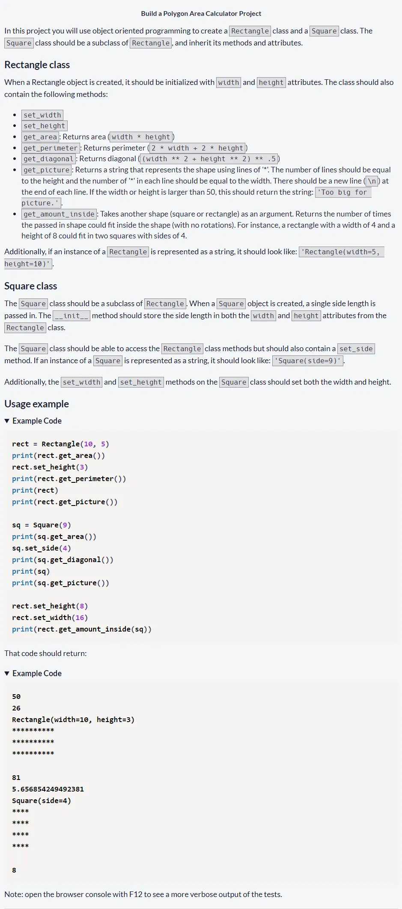
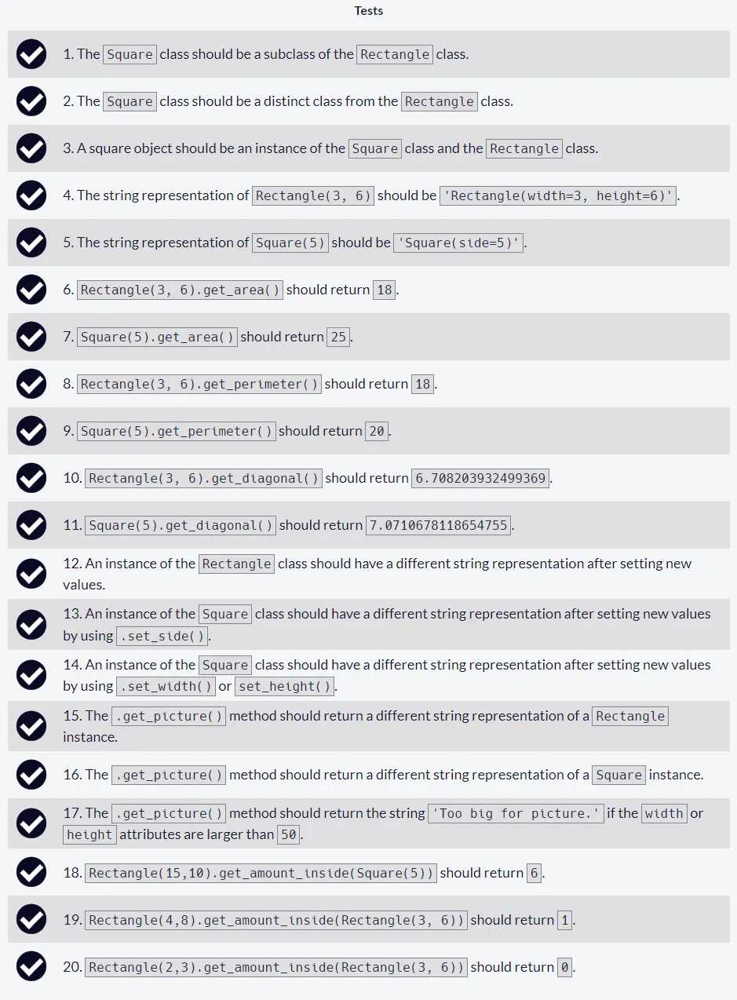

# Build a Polygon Area Calculator Project

Repositorio con el código solución al [cuarto proyecto requisito obligatorio: Build a Polygon Area Calculator Project](https://www.freecodecamp.org/learn/scientific-computing-with-python/build-a-polygon-area-calculator-project/build-a-polygon-area-calculator-project) necesario para obtener la [Freecodecamp Scientific Computing with Python Certification](https://www.freecodecamp.org/learn/scientific-computing-with-python/)

## Tabla de Contenidos

- [Build a Polygon Area Calculator Project](#build-a-polygon-area-calculator-project)
  - [Tabla de Contenidos](#tabla-de-contenidos)
  - [Instructions](#instructions)
  - [Approved Project](#approved-project)
  - [All Tests Passed](#all-tests-passed)
  - [Code Solution](#code-solution)

## Instructions



## Approved Project


## All Tests Passed



## Code Solution

```py
class Rectangle:
    def __init__(self, width, height):
        self.width = width
        self.height = height
    def __repr__(self):
        return f"Rectangle(width={self.width}, height={self.height})"

    def set_width(self, width):
        self.width = width

    def set_height(self, height):
        self.height = height

    def get_area(self):
        return self.width * self.height

    def get_perimeter(self):
        return 2 * self.width + 2 * self.height

    def get_diagonal(self):
        return (self.width ** 2 + self.height ** 2) ** 0.5

    def get_picture(self):
        if self.width > 50 or self.height > 50:
            return "Too big for picture."
        else:
            picture = ""
            for i in range(self.height):
                picture += "*" * self.width + "\n"
            return picture
    def get_amount_inside(self, shape):
        return int(self.get_area() / shape.get_area())

class Square(Rectangle):
    def __init__(self, length):
        super().__init__(length, length)
    def __repr__(self):
        return f"Square(side={self.width})"

    def set_side(self, length):
        self.width = length
        self.height = length
    def set_width(self, width):
        self.set_side(width)
    def set_height(self, height):
        self.set_side(height)
```
